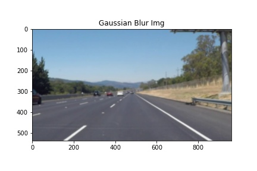
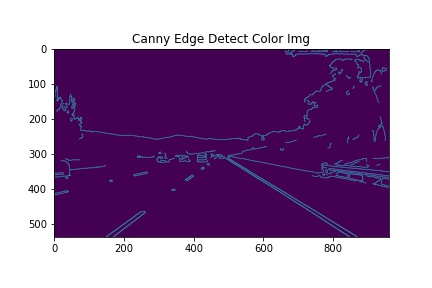
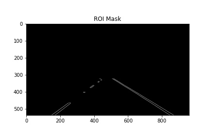
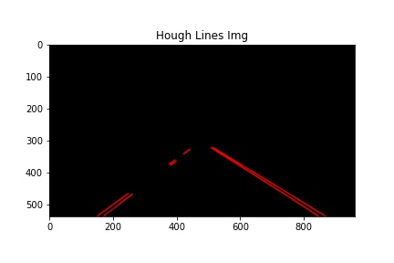
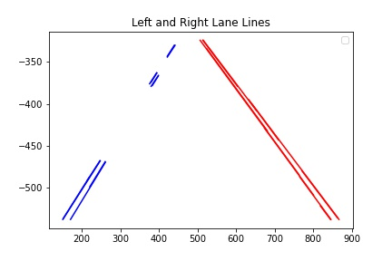
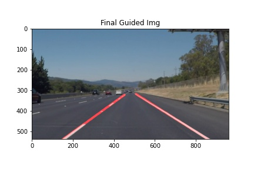

# **Finding Lane Lines on the Road** 

---

## Goals
* Make a pipeline that reliably (90%) draws lane lines on the road

[//]: # (Image References)

[image1]: ./examples/grayscale.jpg "Grayscale"

---

## Reflection

### 1. The pipeline 

NOTE: there is room for parameter tuning in several of the pipeline steps as mentioned

1. Perform a Gaussian Blur with a kernel size of 9 pixels. This reduces the amount of white noise present when processing. The kernel size was determined experimentally as a decently robust, yet effective filter size. TUNE: the kernal size 

2. **Optional** Perform a color conversion to gray-scale. This supposedly makes the edge detection better because of the one dimensional gradient, but using the latest release of openCV has shown that it's performance on three color channels versus one color channel is similar. 

3. Perform Canny Edge Detection with a low threshold of 65 and a high threshold of 120. This returns all pixels with a gradient above the high threshold and pixels with gradient above the low threshold that are adjacent to a high threshold pixel. TUNE: the low and high thresholds (typical values of high threshold are 2-3x larger than low) 

4. Crop the image to a region of interest. This reduces the time and space complexity. The region of interest is a trapezoidal polygon with the vertices \[(0, yMax), (3/8 * xMax, 1/2 * yMax), (5/8 * xMax, 1/2 * yMax), (xMax, yMax)]. TUNE: the roi vertices 

5. Perform Hough Transform to identify lines with a mesh resolution of 1 pixel, an angular resolution of 1 deg, a minimum vote of 15, a minimum line length of 12 pixels, and a maximum line gap of 10 pixels. TUNE: mesh and line parameters 

6. Process the returned lines into lane lines. This can use the most work, as it was built by me, an individual vs the opencv library. I sorted lines into bins based on their slope in relation to it's neighbors, it's position in the image, and it's normal distance to the others in the bin. TUNE: the slope cutoff, the position in the image, and the distance to neighbors 

7. The final step is extrapolating the detected lines into the lane perimeter. This was done by fitting a curve through the line segments to get a smooth, continuous line. They were both extrapolated to the distance of the furthest line segment from the camera. 

### 2. Shortcomings and potential shortcomings with the pipeline

**Known**

* Shadows cause a very high gradient in the same color range as the road that then manifest as lines in the pipeline
    
* Tire marks, old lines (scrubbed lane lines), sticks, etc. will appear to be lines in this pipeline

* This pipeline is only good for highway driving, it will break down at intersections and where the highway diverges

**Potential**

* Tight radius curvature, i.e. lines that cross the middle of the image, may expose issues with the line sorting algorithm

* Lack of visible spectrum light at night will cause errors with the Canny edge detection

* Reflectors that are use in the US southwest may not appear as lines in Canny edge detection

* Standing water and rain could cause more edge detection issues

* High density traffic will expose the heavy reliance of region of interest masking that this pipeline uses, e.g. if a car is too close to the camera, the curves of the bumper will appear in the final lane lines.

### 3. Possible improvements to the pipeline

To keep things simple, I am only going to suggest improvments for the specific use case of highway driving in a continuous lane.

* Filter the lane lines. Even something simple like a median filter of size 5 would improve the performance of the pipeline greatly (the challenge video would be much more smooth)

* Include a state machine to switch rois, canny, and hough parameters. This will provide some clever detection depending on the traffic and road conditions

* Fuse with IR spectrum (and other sensors) to avoid the nighttime issues

* Combine with known data such as map data

* Fix distortion of image by calibrating the camera
